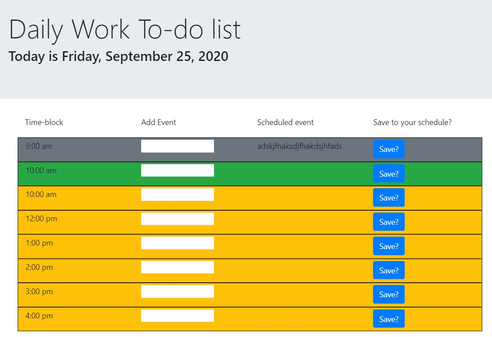

# CalendarApp
This app allows a user to create a schedule by storing an event to a timeslot in local storage for reference later. The app color codes the timeslots (gray for times that are passed, green for times that are current, and yellow for times in the future).

